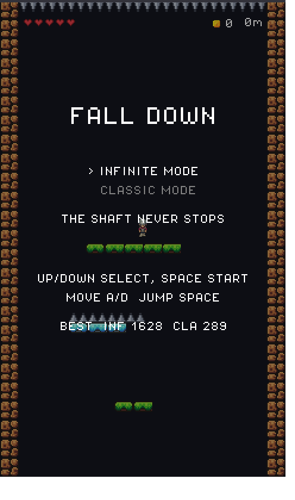
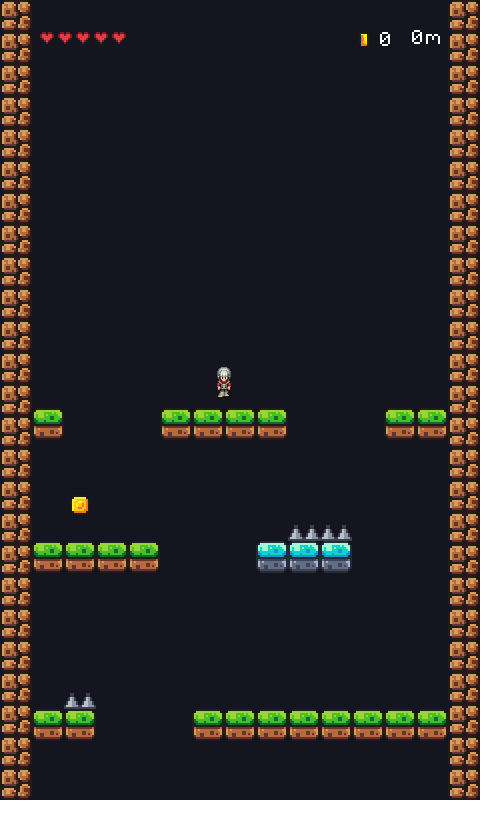

# Fall Down (2D-Fall)

세로 화면(480×800)에서 **끝없이 아래로 떨어지는** NS-Shaft 스타일 하강 액션 게임. [libGDX](https://libgdx.com/)로 만들었다.

발판을 밟으며 내려가고, 가시·슬라임·얼음을 피하고, 코인을 모은다. 깊이 내려갈수록 게임이 어려워지고 배경은 잔디 → 사암 유적 → 핏빛 심연으로 점점 어두워진다.

| 모드 선택 | 클래식 모드 |
|:---:|:---:|
|  |  |

## 게임 모드

### ∞ INFINITE
화면이 자동으로 아래로 스크롤되고 점점 빨라진다. 위에는 천장 가시 — 밀려 올라가면 죽는다. 떠 있는 발판을 밟으며 최대한 깊이 내려가자.

### ◼ CLASSIC
자동 스크롤 없음. 대신 층마다 구멍이 1~2개뿐인 바닥이 이어진다. **점프**로 가시와 슬라임을 넘어 구멍을 찾아 내려가야 한다. 얼음 블럭 위에서는 미끄러지니 조심할 것.

## 규칙

- 하트 5개. 가시·슬라임에 닿으면 -1, 안전한 발판에 처음 착지하면 +1
- 착지 없이 너무 오래 자유낙하하면 낙하 데미지를 입는다 (무한 다이빙 금지!)
- 점수 = 깊이(m) + 코인×5. 모드별 최고 기록 저장

## 조작

| 키 | 동작 |
|---|---|
| ← → / A D | 좌우 이동 |
| SPACE / ↑ / W | 점프 (클래식 전용) |
| ESC / P | 일시정지 |
| R | 재시작 · M | 메뉴로 |

## 실행

```
gradlew lwjgl3:run     # 게임 실행
gradlew lwjgl3:jar     # 러너블 JAR 빌드 (lwjgl3/build/libs/)
```

JDK만 있으면 된다 (Gradle wrapper 포함, Java 8+ 타깃).

## 문서

- [DESIGN.md](DESIGN.md) — 게임 설계 (모드 규칙, 난이도 스케일링, 테마)
- [PROCESS.md](PROCESS.md) — 개발 과정 기록
- [AGENTS.md](AGENTS.md) — AI 에이전트/개발자 작업 가이드
- [LICENSES.md](LICENSES.md) — 에셋 라이선스 정리

## 크레딧

- 타일·몬스터·사운드·음악·폰트: [Brackeys Platformer Assets](https://brackeysgames.itch.io/brackeys-platformer-bundle) (CC0)
- 플레이어 캐릭터: [Mana Seed Character Base](https://seliel-the-shaper.itch.io/character-base) Demo by Seliel the Shaper
- 개발: [05solar](https://github.com/05solar) with Claude Code
